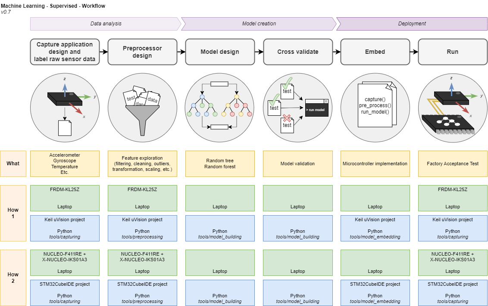

# AI at the edge: data driven decision making

Welcome to this Artificial Intelligence course!
This seven week course is an introduction to data driven decision making.
Although there are many ways to achieve decision making in the domain of AI, this course has its focus on supervised machine learning.
We take a hands-on approach by working on a (mini) project throughout this entire course.

This course is largely based on the workflow for supervised machine learning projects as depicted in the following image. The image shows that a project is divided into three stages: **data analysis**, **model creation** and **deployment**. Each of these stages is divided into two sub stages and for each sub stage a brief description and an image is added to tell and visualize what works needs to be done. The yellow boxes describe an example of _what_ can be done in each sub stage. The green and blue boxes provide a practical example of _how_ this can be achieved. These practical examples are also part of this repository. The workflow will be discussed in detail during the first class.

This repository contains all resources for this course. It is a large collection of files that you need to familiarize yourself with. To help you get familiar, this readme describes the following information:

* [Learning outcomes](#learning_outcomes) of this course
* [Resources](#resources) in this repository
* [Software development tools](#swdevtools) that are used in this course
* [Schedule](#schedule) of this course
* [Assessment](#assessment) of this course
* [Using GitLab](#usinggitlab), in case you are unfamiliar with GitLab

## Learning outcomes
The student:
1. Gets acquainted with simple supervised machine learning models for embedded systems, such as decision tree and
random forest.
2. Gathers data from sensors and/or other sources and extracts relevant characteristics.
3. Explores the features and processes them for application in an ML model.
4. Designs, optimises and validates an ML model.
5. Implements and tests the ML model on an embedded system.

## Resources

The following table provides a high level description of the contents of each of the folders.

|Folder| Description |
|---|---|
|faq| A collection of supporting documents answering frequently asked questions _Do you have anything to add that might be useful for others, please let us know!_ |
|images| Images used in this readme |
|lib| Collection of feature functions written in C and used for both offline training and online deployment |
|sheets| Sheets of the theory topics as presented in classes |
|targets| Demo projects for multiple hardware targets and IDEs |
|template| Template document for final documentation |
|tools| A collection of tools written in Python for each phase of the supervised machine learning workflow |

## Software development tools

The following software development tools are used in this course.

* [A Git client](https://docs.gitlab.com/ee/gitlab-basics/start-using-git.html)
* [Python](https://www.python.org/downloads/)
* An IDE for editing and running Python scripts, such as [Visual Studio Code](https://code.visualstudio.com/) (Recommended), [Pycharm](https://www.jetbrains.com/pycharm/), or [Data Spell](https://www.jetbrains.com/dataspell/).
* An IDE of your own choice for microcontroller development

## Schedule

The following table shows for each week the class content. Classess are given in the form of workshops. This means that a part of the scheduled time will be spend on discussing the sheets. The other part is used for incorperating the acquired knowledge in your project and working on your documentation.

|Week| Content | Sheets | Handin |
|:-:|---|---|---|
|A| - | - | - |
|B| Machine learning basics; development environment installation and setup; making student groups and brainstorming project ideas | 1 Basics | - |
|C| Data analysis | 2 Data | - |
|D| Model creation | 3 Model and 4 Performance | Introduction, Problem Statement and Data analysis via email for feedback |
|E| Deployment | 5 Deploy | - |
|F| Project work | - | - |
|G| Project work | - | Final report via Handin on Saturday before 23.59h |

## Assessment

To demonstrate that you have mastered the learning goals for this course, you will work in pairs on a mini project.
The assignment is to create a proof-of-concept by using a pre fabricated microcontroller development board and shield(s). So there is no need to develop any hardware.
You are allowed to use any microcontroller development board that you would like to. You can for example choose a board that you have used before in a project or a board that is used as a demo as part of this repository.

The final product for this course is a document describing every aspect of the supervised machine learning workflow.
It is **mandatory** to use the provided [template]().

We have compiled a list of [example (mini) projects](./example_projects.md) for you to choose from.
It is also allowed (and even encouraged) to come up with your own project idea. If possible, you can even combine this with your semester project.

## Using GitLab
If you don't know how to use GitLab, you can simply download this repository as a ZIP archive. The downside is that you will have to check this repository for updates manually on a regular interval and merge changes by hand. 
If you would like to get started with GitLab, refer to the following [instructions](https://docs.gitlab.com/ee/gitlab-basics/start-using-git.html). 
 
As a reminder, here is a list of git command line commands that are often used:

* Clone via HTTPS (only the first time) 
  <code>git clone </code>
* Receive changes from GitLab.com 
  <code>git pull origin master</code>
